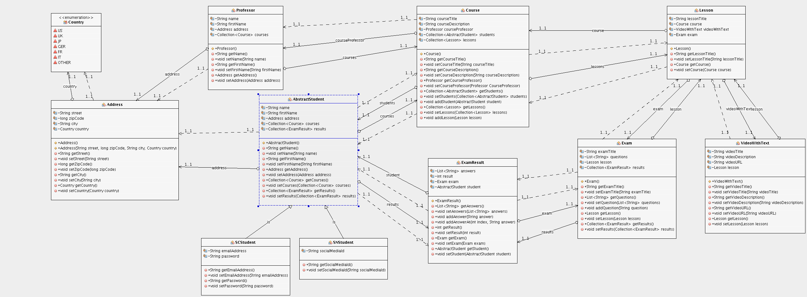

## Synopsis

This is a JavaEE project in the run of my computer science program at the University of Applied Sciences in Regensburg.

## Motivation

It's goal is to build a software system that offers services to and uses services from other projects.

The internal structure is derived from the Boundary-Control-Entity pattern. The class diagram of the entites can be inspected below.

## Entity class diagram

